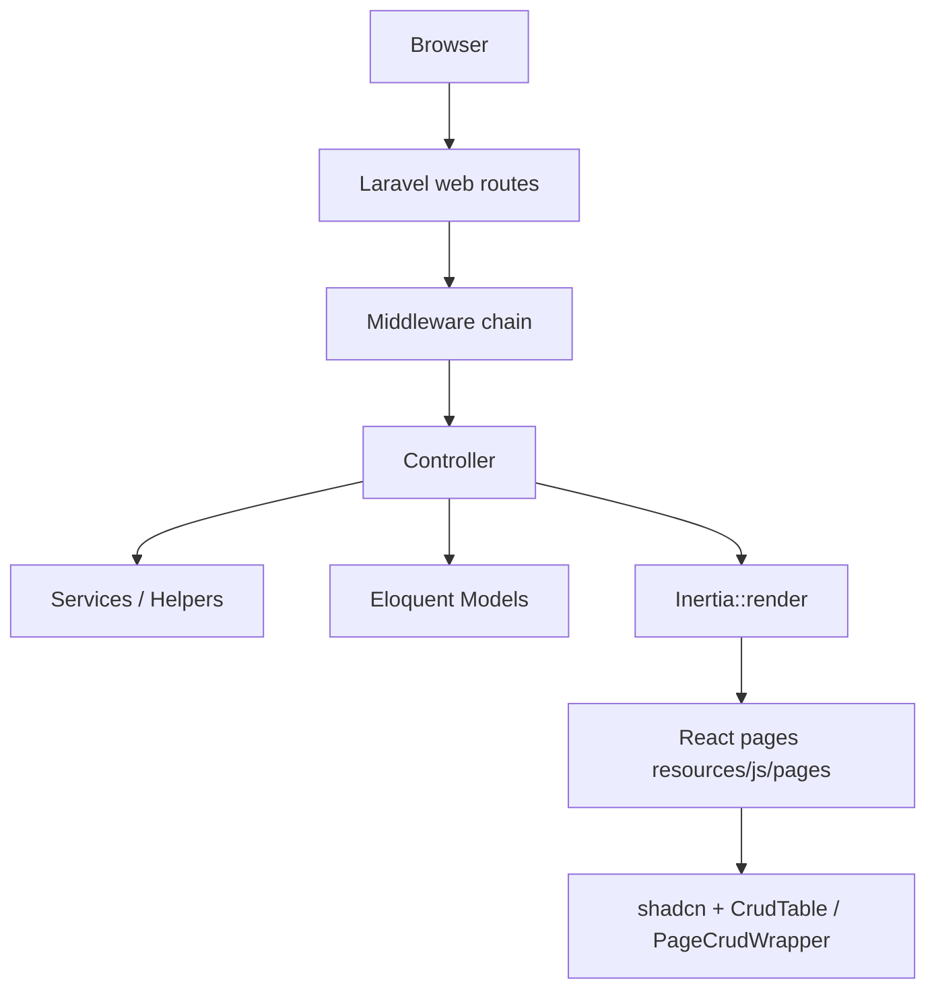

# Project Overview — ESS / HRM (ess.efasttrade.com)

> **Confidence:** High for stack, routing, and module layout (verified in source). Medium for deployment/CI (no `.github/workflows` or committed `.env.example` found). Git repo exists but has **no commits yet** on `master`.

## What This System Is

A **Human Resource Management (HRM) / Employee Self-Service (ESS)** web application, marketed as **HRM SaaS** when `IS_SAAS=true`. It supports:

- Multi-tenant **company** accounts with **employees**
- Optional **superadmin** platform operator
- Full HR lifecycle: org structure, attendance, leave, payroll, recruitment, performance, training, assets, meetings, documents, contracts
- Optional **SaaS billing** (plans, coupons, 30+ payment gateways)
- Public **landing page**, **career portal**, and **installer** flow

The product README is minimal (`# HRM`); behavior is defined almost entirely in code.

---

## Tech Stack

| Layer | Technology | Version / Notes |
|-------|------------|-----------------|
| Backend | Laravel | ^12.0 (`composer.json`) |
| PHP | PHP | ^8.2 |
| Frontend | React + TypeScript | React 19, TS 5.7 |
| SPA bridge | Inertia.js | `@inertiajs/react` ^2, `inertiajs/inertia-laravel` ^2 |
| Routing (client) | Ziggy | `tightenco/ziggy` — `route()` in TS |
| UI | shadcn/ui + Radix + Tailwind CSS v4 | `components.json`, `@tailwindcss/vite` |
| Auth | Laravel session guard + email verification | `config/auth.php` |
| RBAC | Spatie Laravel Permission | Custom middleware bypasses superadmin |
| Media | Spatie Media Library | Uploads, batch API |
| PDF/Docs | DomPDF, PhpSpreadsheet, PhpWord | Reports, imports |
| Payments | Stripe, PayPal, Razorpay, Cashfree, Mollie, … | Many dedicated controllers |
| Queue | Database driver (default) | `config/queue.php`; **no `app/Jobs` classes** |
| Cache | Laravel cache tables | From default migrations |
| Installer | `rachidlaasri/laravel-installer` | Gated by `storage/installed` |
| Testing | Pest + PHPUnit | SQLite in-memory in `phpunit.xml` |
| Error tracking | LaraBug | Optional |

**There is no `routes/api.php`.** JSON-style endpoints live inside `routes/web.php` (e.g. `api/media/*`, `api/chatgpt/generate`).

---

## High-Level Architecture



### Architectural Style

- **Monolithic Laravel app** with **Inertia** (not a separate REST API SPA).
- **No repository layer** — controllers query Eloquent directly; some logic in `app/Services` and `app/Helpers/helper.php`.
- **Multi-tenancy** via `users.created_by`, `getCompanyId()`, `getCompanyAndUsersId()` — not Laravel teams or separate DBs.
- **Permission scoping** via Spatie permissions **and** `AutoApplyPermissionCheck` trait on many models/controllers.

---

## Folder Structure

```
ess.efasttrade.com/
├── app/
│   ├── Console/Commands/     # Scheduled HR commands (leave accrual, penalties)
│   ├── Events/               # UserCreated
│   ├── Helpers/helper.php    # Global functions (autoloaded)
│   ├── Http/
│   │   ├── Controllers/      # ~163 controllers (flat + Auth/Settings/LandingPage)
│   │   ├── Middleware/       # 17 custom middleware
│   │   └── Requests/         # ~9 FormRequests (sparse vs controllers)
│   ├── Libraries/            # Payment SDK wrappers (Coingate, Easebuzz, Tap)
│   ├── Listeners/
│   ├── Mail/
│   ├── Models/               # 124 models
│   ├── Observers/            # User, Plan
│   ├── PathGenerators/       # Media paths
│   ├── Providers/
│   ├── Services/             # 9 service classes
│   └── Traits/               # AutoApplyPermissionCheck
├── bootstrap/app.php         # Middleware, routing, CSRF exceptions
├── database/migrations/      # 126 migrations
├── database/seeders/         # Large demo seed set when IS_DEMO=true
├── public/                   # Web root (also index.php at project root)
├── resources/
│   ├── js/                   # React app (pages, components, config/crud)
│   ├── css/                  # Tailwind + dark-mode + RTL
│   ├── lang/                 # JSON locale files (en, ar, de, …)
│   └── views/app.blade.php   # Inertia root
├── routes/
│   ├── web.php               # ~1,362 lines — primary routes
│   ├── auth.php
│   └── settings.php
└── tests/                    # Pest feature tests (auth, plans, leave accrual)
```

---

## Request Flow

### 1. Global web middleware (`bootstrap/app.php`)

Every web request passes:

1. `CheckInstallation` — redirects to installer until `storage/installed` exists
2. `HandleAppearance` — theme cookie
3. `ShareGlobalSettings` — view/shared settings
4. `HandleInertiaRequests` — shared Inertia props (`auth`, `globalSettings`, `ziggy`, `csrf_token`, flash)
5. `AddLinkHeadersForPreloadedAssets`
6. `DemoModeMiddleware` — blocks PUT/PATCH/DELETE and sensitive POSTs when `IS_DEMO=true`

### 2. Route groups (`routes/web.php`)

| Zone | Middleware | Purpose |
|------|------------|---------|
| Public | — | Landing, payment callbacks, careers `{userSlug?}/career`, translations |
| Authenticated shell | `auth`, `verified`, `setting` | Logged-in app |
| SaaS features | `checksaas` | Plans, payments, company registration |
| HR app | `plan.access` | Blocks expired/trial companies (SaaS) |
| Per-module | `permission:manage-*` | Spatie permission on route |
| Superadmin CMS | `SuperAdminMiddleware` | Landing page admin, impersonation |

### 3. Controller → Inertia page

Example — employee list:

```php
// EmployeeController::index
if (Auth::user()->can('manage-employees')) {
    // Manual query scoping with manage-any / manage-own permissions
    return Inertia::render('hr/employees/index', [...]);
} else {
    return redirect()->back()->with('error', __('Permission Denied.'));
}
```

Frontend resolves `hr/employees/index` → `resources/js/pages/hr/employees/index.tsx`.

### 4. Shared Inertia props (`HandleInertiaRequests`)

```php
'auth' => [
    'user' => ..., // merged with avatar URL via check_file/get_file
    'roles' => fn() => $request->user()?->roles->pluck('name'),
    'permissions' => fn() => $request->user()?->getAllPermissions()->pluck('name'),
],
'globalSettings' => $globalSettings, // from settings() helper + currency
'csrf_token' => csrf_token(),
'ziggy' => ...,
```

---

## User & Tenancy Model

### User types (`users.type`)

| Type | Role | Scope |
|------|------|-------|
| `superadmin` | Platform admin | All data; middleware bypass |
| `company` | Tenant owner | Own company + employees via `created_by` |
| `employee` | Staff user | Row-level filters in `AutoApplyPermissionCheck` |

SaaS fields on `User` (when `isSaas()`): `plan_id`, `plan_expire_date`, `trial_*`, `referral_code`, `storage_limit`, etc.

### Tenancy helpers (`app/Helpers/helper.php`)

- `getCompanyId($userId)` — resolves owning company user id
- `getCompanyAndUsersId()` — company + all staff user ids for `whereIn('created_by', ...)`
- `createdBy()` / `creatorId()` — record ownership
- `isSaas()` — reads `config('app.is_saas')` (default **true** in `config/app.php`)

**Confidence:** High — used hundreds of times in controllers.

---

## Backend Patterns

### Controllers (~163)

- Naming: `{Entity}Controller` in `app/Http/Controllers/`
- Most HR controllers extend plain `Controller`, not `BaseController`
- **Seven** extend `BaseController` (uses `AutoApplyPermissionCheck`): `User`, `Role`, `Permission`, `Translation`, `PlanRequest`, `Coupon`, `PlanOrder`
- Actions: explicit routes (`Route::get/post/put/delete`), **not** `Route::resource` for HR
- Route names: `hr.{resource}.{action}` (e.g. `hr.employees.index`)
- Authorization: **dual** — route middleware `permission:...` **and** `Auth::user()->can(...)` inside methods
- Validation: mix of `Validator::make()`, inline rules, and few `FormRequest` classes
- Responses: `Inertia::render()`, `redirect()->back()->with('error'|'success')`, occasional JSON for media/payments

### Models (124)

- **`BaseModel`** + `AutoApplyPermissionCheck` — ~80 HR entities
- **`Model` directly** — `Employee`, `Plan`, `Contact`, templates, SaaS tables, etc. (**inconsistent**)
- **`User`** extends `BaseAuthenticatable` with `HasRoles`, `Impersonate`, `MustVerifyEmail`
- **No `SoftDeletes`** trait found; `User` has `delete_status` column (custom pattern, low usage)
- Common columns: `created_by`, `status`, `employee_id` (for employee-scoped rows)

### Services (`app/Services/`)

| Service | Role |
|---------|------|
| `HrEventNotificationService` | Leave/WFH/attendance regularization emails + `hr_notifications` |
| `WebhookService` | Outbound webhooks per module (singleton) |
| `MonthlyPaidLeaveAccrualService` | PL accrual business rules |
| `LatePenaltyApplicator` | Attendance late penalties |
| `EmailTemplateService` / `MailConfigService` | Templated mail, per-tenant SMTP |
| `StorageConfigService` / `DynamicStorageService` | S3/Wasabi from DB settings |
| `UserService` | Default role/type on user create |

### Events / observers

- `UserCreated` event → `SendUserCreatedEmail` listener
- `UserObserver` — default plan, referral code, `createDefaultSettings` / `copySettingsFromSuperAdmin`
- `PlanObserver` — plan lifecycle

### Console commands (background logic)

- `LeaveMonthlyAccrualCommand`, `LeaveYearEndResetCommand`, `LeaveRecomputeBalancesCommand`, `LeaveResetCarryForwardCommand`
- `ApplyLatePenaltyCommand`
- `AssignDefaultPlanToUsers`

**Note:** No `app/Jobs`; queue tables exist but async work is mostly commands + sync processing.

---

## Frontend Architecture

### Entry (`resources/js/app.tsx`)

- Providers: `ModalStackProvider` → `LayoutProvider` → `SidebarProvider` → `BrandProvider`
- Page resolution: `./pages/${name}.tsx` via Vite glob
- i18n must initialize before first render
- Blocks external `envato.workdo.io` script injection

### Page patterns (~202 `.tsx` files)

**Pattern A — Manual CRUD (majority of HR)**

- `PageTemplate` wrapper
- `SearchAndFilterBar` + `router.get(route(...), filters, { preserveState: true })`
- `CrudTable` + `CrudFormModal` / `CrudDeleteModal`
- `hasPermission(permissions, 'manage-...')` from `@/utils/authorization`

**Pattern B — Config-driven CRUD**

- `PageCrudWrapper` + `resources/js/config/crud/*.ts` (users, roles, permissions, coupons, currencies, contacts, plan-orders, plan-requests)

**Pattern C — Full-page forms**

- Employees: dedicated `create` / `edit` / `show` pages (not modal-only)

### Layouts

- Authenticated: `app-layout.tsx` → `app-sidebar-layout.tsx`
- Auth: `auth-layout.tsx` (+ split/card variants)

### Permissions on client

```ts
// resources/js/utils/authorization.ts
hasPermission(userPermissions, 'manage-employees')
hasRole('superadmin', userRoles)
```

**Backend is authoritative** — frontend only hides UI.

---

## Major Business Modules

### Core HR

| Module | Models (examples) | Notable workflows |
|--------|-------------------|-------------------|
| Organization | `Branch`, `Department`, `Designation` | `created_by` scoping |
| Employees | `User` (type=employee) + `Employee` | User+Employee dual record; import XLSX; plan max employees |
| Attendance | `AttendanceRecord`, `AttendancePolicy`, `Shift` | Clock in/out; biometric; regularization approval |
| Leave | `LeaveApplication`, `LeaveBalance`, `LeavePolicy` | Approve/reject; balance deduction; monthly accrual commands |
| WFH | `WorkFromHomeRequest` | Same notification pattern as leave |
| Payroll | `PayrollRun`, `Payslip`, `EmployeeSalary` | Bulk payslip generation (demo-restricted) |
| Time | `TimeEntry`, `DailyTimesheet` | Timesheet items (**migration gap possible**) |

### Talent & performance

- **Recruitment:** requisition → posting → candidate → interviews → offer → onboarding
- **Training:** programs, sessions, assessments
- **Performance:** indicators, goals, review cycles

### Operations

- **Meetings:** rooms, attendees, minutes, action items
- **Assets:** types, assignments, maintenance, depreciation
- **Documents:** HR docs, acknowledgments, templates (NOC, joining letter, experience cert)
- **Lifecycle:** awards, promotions, warnings, complaints, trips, resignations, terminations

### Platform (SaaS)

- Plans, orders, requests, coupons, referrals, payouts
- Landing page CMS (`LandingPageSetting`, custom pages)
- Impersonation (`lab404/laravel-impersonate`)
- IP restrictions, login history

### Notifications

`HrEventNotificationService` maps events:

- `leave_apply`, `leave_status`, `wfh_apply`, `wfh_status`, `ar_apply`, `ar_status`

Creates `HrNotification` records and sends company-configured email templates.

---

## API / “API” Conventions

Despite no REST API file:

- **Session auth** for all authenticated routes
- **CSRF** required; token in Inertia `csrf_token` and axios meta
- **Flash messages:** `success`, `error` session keys
- **Permission denied:** `redirect()->back()->with('error', __('Permission Denied.'))`
- **Pagination:** `per_page` query param, default 10
- **Filters:** `search`, `sort_field`, `sort_direction`, domain filters (`status`, `department`, etc.)
- **Media API:** prefix `api/media` under auth + permission middleware

---

## Database Design (summary)

- **126 migrations** — incremental alters common (e.g. `add_column_job_posting_table`)
- **Spatie permission tables** + standard Laravel (`users`, `sessions`, `jobs`, `cache`)
- **Tenancy:** `created_by` on most business tables
- **Relationships:** classic Eloquent `belongsTo` / `hasMany`; some employee joins in permission trait
- **No Eloquent SoftDeletes** detected
- **Seeders:** full demo dataset when `IS_DEMO=true`; production minimal (permissions, roles, plans, superadmin, company, templates)

---

## Configuration Flags

| Env / config | Effect |
|--------------|--------|
| `IS_SAAS` (`config('app.is_saas')`) | SaaS features, plan limits, referral |
| `IS_DEMO` | DemoModeMiddleware restrictions |
| `APP_URL` | Ziggy, file URLs |
| `FILESYSTEM_DISK` | Default storage; overridden per tenant via settings |
| `QUEUE_CONNECTION` | Default `database` |

---

## Key Architecture Decisions (Observed)

1. **Inertia over API** — simpler deployment, shared auth session, Ziggy route parity.
2. **Permission strings everywhere** — `manage-{module}`, `manage-any-{module}`, `manage-own-{module}`, `create-*`, `view-*`, etc.; seeded in `PermissionSeeder`.
3. **Superadmin bypass middleware** — replaces default Spatie middleware classes.
4. **Fat controllers** — `EmployeeController` 1300+ lines; business logic often inline.
5. **Global helpers** — `helper.php` is central; prefer extending existing helpers over new abstractions.
6. **Monolithic `web.php`** — all routes in one file (+ `settings.php`, `auth.php`).
7. **CRUD UI kit** — invest in `CrudTable` / `PageCrudWrapper` for consistency on admin modules; HR often custom.

---

## Gaps & Uncertainties

| Item | Confidence |
|------|------------|
| Production deployment (FTP/Laragon hints: `.ftpquota`, root `index.php`) | Low — no Docker/CI in repo |
| `DailyTimesheet` tables | Medium — models exist; migration not confirmed in listing |
| `PublicFormController` | High — no routes wired |
| Git workflow | High — repo has no commits yet |
| Scheduled cron registration for console commands | Medium — check server crontab outside repo |

---

## Related Docs

- `CURSOR_RULES_SUGGESTION.md` — rules for AI assistants
- `RISK_AREAS.md` — fragile areas
- `QUICK_START_FOR_NEW_DEVELOPER.md` — local setup
